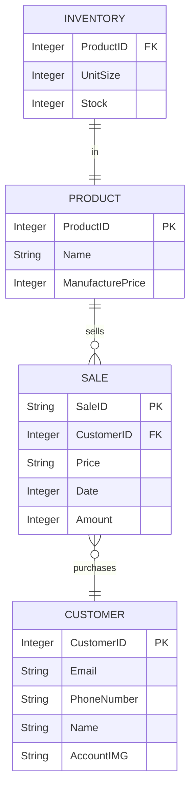

## Documentation

#### INVENTORY
 * **ProductID _(FK)_**: The product the inventory is keeping track of
 * **UnitSize**: The size of the batch of the particular product
 * **Stock**: The quantity in storage

 <u>**INVENTORY** has one and only one **PRODUCT** and **PRODUCT** has one and only one **INVENTORY**</u>

 #### PRODUCT
 * **Name**: Display name of the product
 * **ManufacturePrice**: Price to manufacturer the item

 <u>**PRODUCT** 0 or many **SALE** and **SALE** has one and only one **PRODUCT**</u>

 #### SALE
 * **CustomerID _(FK)_**: The customer that made the purchase
 * **Price**: Total price of the purchase
 * **Date**: Date purchased (Stored as Integer)
 * **Amount**: Amount purchased (usually 1)

 <u>**SALE** has one and only one **CUSTOMER** and **CUSTOMER** 0 or many **SALE**</u>

#### CUSTOMER
 * **Email**: Registered email
 * **PhoneNumber**: Phone number (in the format of a String)
 * **Name**: username
 * **AccountIMG**: Image of the profile (optional)